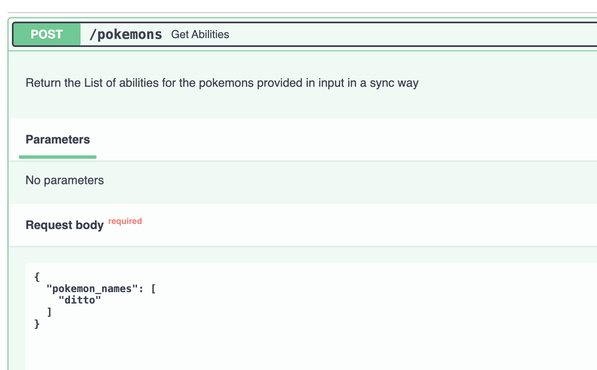
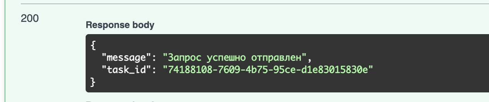
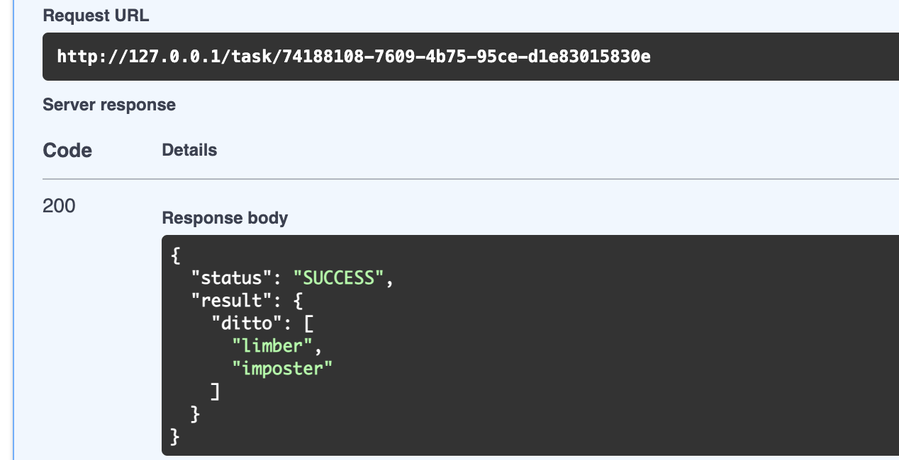

## Сборка
Прописать `.env` файл по аналогии с `.env.dist`
```
docker compose up --build
```
Дальше заходим на `localhost:80`, там развернут FastAPI. Можем через него тестировать

## В чем суть
Есть API для Покемонов, куда можно отправить список имен покемонов и получить их способности. Эндпоинт `/pokemons` принимает список имен и возвращает `task_id`. По этому `task_id` можем посмотреть, что произошло с нашей Celery задачей через эндпоинт `/task/{task_id}`

## Пример
Запрос


Ответ


Ответ от `/task/{task_id}`
